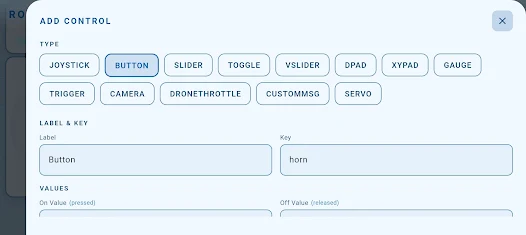

# SAR

Vehículo Arduino UNO controlado desde **RoboLink por Bluetooth Classic**: movimiento proporcional y protección opcional por sensores.

**No requiere bibliotecas externas.** Ambos sketches usan únicamente `SoftwareSerial`, incluida en **Arduino AVR Boards** para Arduino UNO. No se necesitan NeoPixel ni bibliotecas de servos.

**Primera puesta en marcha:** cablear → cargar el configurador Bluetooth → comprobar su resultado → cargar SAR → configurar RoboLink → probar con las ruedas levantadas.

## 1. Qué archivo cargar

| Programa | Para qué sirve | Cuándo cargarlo |
|---|---|---|
| [Configurar_BT_SAR.ino](firmware/Configurar_BT_SAR/Configurar_BT_SAR.ino) | Ajusta el HC-06 a 38400 y solicita el nombre SAR | Primera instalación o módulo nuevo |
| [SAR.ino](firmware/SAR/SAR.ino) | Controla motores y sensores | Después de configurar Bluetooth; es el programa de uso diario |

**Son dos programas separados.** El configurador no conduce el vehículo. No abrir ambos `.ino` como pestañas del mismo sketch.

Para descargar: botón **Code → Download ZIP**, extraer el ZIP y abrir el `.ino` dentro de su carpeta. Mantener juntos cada archivo y su carpeta del mismo nombre.

## 2. Materiales y cableado

Arduino UNO, L298N, dos motores DC adecuados a la alimentación, HC-06, HC-SR04 y dos sensores IR digitales.

Conectar con la alimentación apagada:

| Módulo / terminal | Arduino UNO o destino |
|---|---|
| L298N ENA / ENB | **D9 / D10** |
| L298N IN1 / IN2 / IN3 / IN4 | **D4 / D5 / D6 / D7** |
| L298N OUT1–OUT2 | Motor izquierdo |
| L298N OUT3–OUT4 | Motor derecho |
| **TXD del HC-06** | **D13**, recepción del Arduino |
| **RXD del HC-06** | **D12 mediante divisor**, transmisión del Arduino |
| HC-SR04 TRIG / ECHO | **D2 / D3** |
| IR izquierdo OUT / derecho OUT | **D8 / D11** |
| GND de todos los módulos y fuentes | **GND común** |

**Retirar los jumpers ENA y ENB** para regular velocidad. No confundirlos con el jumper del regulador de 5 V del L298N.

Divisor para RXD del HC-06:

```text
Arduino D12 ── 1 kΩ ──┬── RXD del HC-06
                      │
                     2 kΩ
                      │
                     GND
```

Los 2 kΩ pueden ser dos resistencias de 1 kΩ en serie. TXD del HC-06 va directamente a D13.

Alimentación:

- Motores: fuente adecuada a su tensión nominal, conectada a la entrada de potencia del L298N. Su caída de tensión también debe considerarse.
- HC-SR04 y módulos IR compatibles con 5 V: VCC a 5 V. HC-06: 5 V en VCC **solo si la placa adaptadora lo admite**; el módulo desnudo requiere comprobar su especificación.
- No unir salidas de fuentes/reguladores entre sí. El jumper de alimentación del L298N depende de su placa y tensión: comprobar su documentación.

## 3. Preparar Arduino IDE

1. Instalar Arduino IDE y el paquete **Arduino AVR Boards** desde el gestor de placas, si falta.
2. Conectar el UNO por USB y seleccionar **Arduino Uno** y su puerto.
3. Abrir el sketch correspondiente y cargarlo. **No hace falta instalar ninguna biblioteca adicional.** `SoftwareSerial` viene con el paquete de placas.

El firmware está preparado para **Arduino UNO**, no para cualquier modelo de placa. En un PC nuevo puede ser necesario instalar el controlador USB de su placa, especialmente si es un clon.

## 4. Configurar automáticamente el HC-06

**Antes:** desconectar RoboLink del módulo y dejar sin potencia los motores. El HC-06 debe estar alimentado pero sin enlace Bluetooth.

1. Abrir [Configurar_BT_SAR.ino](firmware/Configurar_BT_SAR/Configurar_BT_SAR.ino).
2. Cargarlo en el UNO.
3. Abrir el monitor serie a **115200 baudios**. No enviar ninguna tecla.
4. Esperar aproximadamente **6–16 segundos**. El programa prueba 38400 y 9600, cambia a 38400 si corresponde y solicita el nombre `SAR`.
5. Continuar cuando aparezca **`EXITO: nombre SAR aceptado y baud 38400`**. `BAUD OK` por sí solo no confirma el nombre.
6. Si aparece `NO CONFIRMADO` o `NOMBRE NO CONFIRMADO`, revisar el mensaje y la [tabla de diagnóstico](#8-si-algo-no-funciona). `R` en el monitor repite el proceso.
7. Reiniciar la alimentación del HC-06. Si el teléfono conserva el nombre anterior, olvidarlo y buscarlo otra vez.

El nombre se considera aceptado cuando responde `OKsetname`; comprobar en el teléfono que realmente aparece como **SAR**. No cambia el PIN. Algunos clones usan otros comandos AT: el configurador no afirma éxito sin la respuesta esperada.

### Por qué 38400 y no 9600

RoboLink envía repetidamente posición del joystick y estados de botones. Una trama de 50 caracteres ocupa unos **52 ms a 9600**, frente a **13 ms a 38400**, con 10 bits por carácter. Si se envía cada 30 ms, 9600 no alcanza para mantener ese ritmo.

El firmware SAR escucha a **38400**; el HC-06 debe usar la misma velocidad. Si no coinciden, pueden llegar datos ilegibles o no funcionar el control. Subir el baud no elimina las rampas ni garantiza ausencia de interferencias.

| Enlace | Velocidad |
|---|---|
| Arduino ↔ HC-06 por cables TX/RX | **38400** |
| Arduino ↔ monitor serie por USB | **115200** |

El monitor USB a 115200 **no cambia el baud del HC-06**. La app se conecta por Bluetooth Classic; no se configura a 115200 por usar el monitor.

## 5. Cargar el programa de conducción

1. Abrir [SAR.ino](firmware/SAR/SAR.ino) y cargarlo en el UNO.
2. Monitor serie a **115200**: debe aparecer `SAR listo - MANUAL;BT=38400;USB=115200`.
3. Emparejar el teléfono con **SAR** y conectarlo desde RoboLink mediante Bluetooth Classic. Usar el PIN configurado en el módulo; los habituales son 1234 o 0000, pero este proyecto no los modifica.
4. Configurar el preset siguiendo la sección siguiente.

## 6. Configurar RoboLink

**[Abrir la guía visual paso a paso para estudiantes](docs/ROBOLINK.md)**: usa las capturas de la app y explica EDIT, + Add, los tipos de control y los valores de cada campo.



Recorrido básico: **EDIT → + Add → elegir el tipo → completar Label, Key y valores → confirmar el formulario → DONE**. Para la conexión elegir **Bluetooth**, no Wi-Fi/UDP. Los nombres de campos inferiores pueden variar según la versión.

Crear un preset con **un joystick XY**, datos `clave:valor` separados por comas y **salto de línea LF** al final. Empezar con envío repetido cada **30 ms**; si la app no permite fijarlo, verificar su frecuencia con el registro serie.

### Controles principales

| Nombre sugerido | Tipo | Clave de datos | Valores / comportamiento |
|---|---|---|---|
| Dirección | Eje X del joystick | `x` | 0 izquierda, **100 centro**, 200 derecha; retorna a 100 al soltar |
| Avance | Eje Y del mismo joystick | `y` | 0 retroceso, **100 centro**, 200 avance; retorna a 100 al soltar |
| Potencia | Slider entero | `p` | 80–255; **inicial 100 para la primera prueba** |
| Giro | Slider entero | `g` | 20–150; inicial 100 |
| PARAR | Botón momentáneo | `s` | 1 presionado, 0 liberado; mantener presionado mientras se desea impedir marcha |
| Protección sensores | **Toggle mantenido** | `r` | 1 activada, 0 desactivada; inicial 1 |

El firmware inicia con potencia 160; el slider `p:100` la baja para la primera prueba. `p` es PWM, no velocidad medida. No usar cero como centro del joystick: **el centro en la app es 100**.

**No agregar el botón de modo al primer preset.** Omitir `m` o mantenerlo en 0. Un flanco `m:1` activa el modo autónomo heredado de SAR, que puede seguir moviéndose sin órdenes manuales. No es necesario para conducir con el joystick.

Ejemplo de reposo:

```text
x:100,y:100,p:100,g:100,s:0,r:1
```

Agregar un **LF real** al final, no los dos caracteres literales `\n`. Usar claves minúsculas y números enteros. Si reutilizás el preset anterior, retirar los controles de luces y servos (`l/a/n/v/u/w`); esta edición no los utiliza.

## 7. Primera prueba y comportamiento esperado

1. Levantar las ruedas, dejar libres los sensores y mantener accesible la desconexión de potencia. Probar sin carga alta.
2. Conectar RoboLink, dejar joystick centrado y comprobar que `cmd` aumenta en el monitor.
3. Avanzar lentamente y comprobar ambos motores. Si uno gira invertido, apagar la alimentación antes de intercambiar sus dos cables.
4. Probar izquierda/derecha. **Solo X, con Y centrado, gira sobre el eje**: es el comportamiento SAR.
5. Mantener PARAR presionado: las salidas de motor deben quedar en cero. Al soltar, un joystick todavía inclinado puede volver a moverlo; STOP no está enclavado.
6. Con `r:1`, acercar un objeto al frontal y a cada IR. Comprobar que el vehículo se detenga con la protección activada.
7. Desconectar Bluetooth en MANUAL: tras 250 ms sin órdenes de movimiento comienza la parada con rampa. Finalmente probar en el suelo a baja potencia.

Con protección activa, cualquier IR LOW bloquea movimiento. El ultrasonido bloquea objetivos positivos, incluidos pivotes, con distancia **≤20 cm o sin eco**. Las lecturas de 3–5 cm no son un fallo de Bluetooth: provocan bloqueo. `r:0` desactiva ese frenado; usarlo sobre soporte para aislar un problema y volver a activar protección.

Al retirar un obstáculo, una orden mantenida puede reanudar la marcha. No hay detección de bordes ni sensor trasero. La rampa +8/−12 cada 10 ms tarda nominalmente 200 ms de PWM 0 a 160; no mide velocidad ni asegura estabilidad. Un muñeco alto necesita base estable y centro de gravedad bajo.

## 8. Si algo no funciona

| Síntoma | Qué comprobar |
|---|---|
| Configurador sin `OK` | HC-06 sin enlace con el teléfono; TXD→D13, RXD←D12 con divisor; GND; módulo a 9600 o 38400. Otros baudios/clones requieren revisión específica |
| `BAUD OK` pero nombre no confirmado | No afirmar que se renombró; revisar respuesta AT. Puede ser otro firmware de HC-06 |
| Sigue apareciendo el nombre anterior | Reiniciar el módulo, olvidar el emparejamiento y buscarlo de nuevo |
| No hay movimiento y `cmd` no aumenta | Conexión, baud 38400, LF y claves del preset. Enviar **RX** + salto de línea por USB para ver lo recibido |
| `cmd` aumenta pero `block=1` | Revisar `dist`, IR y `r`; no cambiar baud por un bloqueo de sensor |
| El LED L parpadea | Comparte D13 con recepción Bluetooth; por sí solo no indica avería |
| Repite el mensaje de arranque | Posibles reinicios: revisar alimentación al accionar los motores |

`TEL` muestra ejes internos −100..100, PWM aplicado `left/right`, distancia, protección, IR, bloqueo y contadores. `cmd` cuenta órdenes de movimiento. Por USB, `?` muestra ayuda y `STATUS` muestra calibración; enviar siempre salto de línea.

## 9. Verificación y alcance

El control SAR previo fue probado por el usuario. Esta edición del repositorio se comprueba mediante compilación UNO y pruebas de lógica en AVR con periféricos simulados; **no equivalen a verificar el cableado final, el cambio AT real, la radio ni la estabilidad física**.

[Cómo repetir compilación y pruebas](docs/VERIFICACION.md). La biblioteca estándar mantiene la licencia de su autor; sus fuentes vienen con Arduino AVR Boards.
