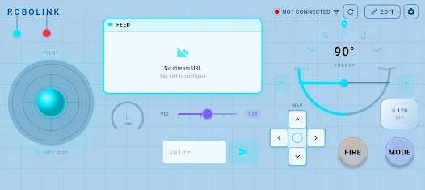
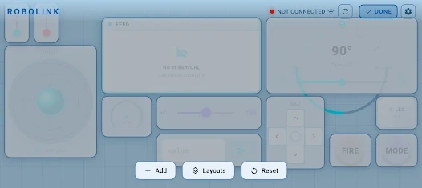
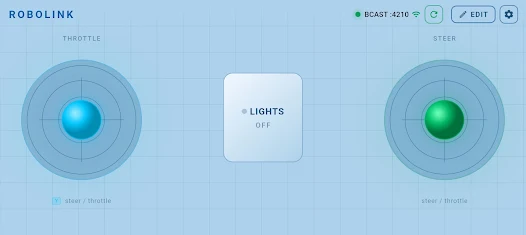
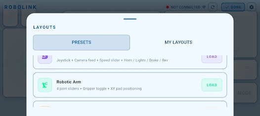
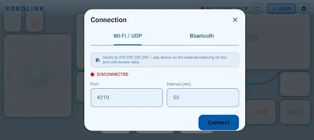

# RoboLink para SAR: guía visual para estudiantes

Esta guía corresponde a **SAR sin LEDs ni servos**. Para conducir se crean cinco controles: **un joystick, dos sliders, un botón y un toggle**.

Las capturas fueron aportadas por el usuario. Algunas ventanas están recortadas: muestran los nombres superiores, pero no todos los campos ni la confirmación inferior. Desplazá el formulario hacia abajo cuando falte un campo; la ubicación exacta puede cambiar según la versión de RoboLink.

## 1. Antes de abrir la app

1. Cablear y cargar el configurador Bluetooth siguiendo el [README](../README.md#4-configurar-automáticamente-el-hc-06).
2. Confirmar nombre **SAR** y baud **38400** en el monitor.
3. Cargar después **SAR.ino**. El configurador no controla el vehículo.
4. Emparejar SAR en los ajustes Bluetooth del teléfono.
5. Para configurar y probar, levantar las ruedas y mantener accesible la desconexión de potencia.

## 2. Reconocer la pantalla



Arriba a la derecha está **EDIT**. La pantalla de ejemplo tiene cámara, torreta, LED y otros controles: **no son necesarios para SAR**. No copiar sus claves ni pulsar MODE para la primera prueba, porque puede activar movimiento autónomo si envía `m`.

1. Pulsar **EDIT**.
2. Aparecen abajo **+ Add**, **Layouts** y **Reset**; arriba, **DONE**.
3. Pulsar **+ Add** para crear cada uno de los cinco controles.



**DONE** termina la edición del panel. **Layouts** abre diseños; **Reset** puede modificar el panel, así que no usarlo como botón de parada del robot.

## 3. Elegir el tipo correcto en Add Control


En **TYPE**, elegir según esta tabla:

| Opción visible | Qué hace | En SAR se usa para |
|---|---|---|
| **JOYSTICK** | Se arrastra en dos ejes y vuelve al centro | Dirección y avance juntos |
| **SLIDER** | Barra para elegir un número | Potencia y giro |
| **BUTTON** | Vale 1 mientras se pulsa y 0 al soltar | PARAR |
| **TOGGLE** | Mantiene ON u OFF después de soltar | Protección por sensores |

No usar **SERVO**, cámara ni controles de luces en esta edición.

**Label** es el texto que verá el estudiante. **Key** es el dato que entiende el firmware: debe copiarse exactamente, en minúsculas. Por ejemplo, poner Label `PARAR` y Key `s`; dejar la clave `horn` de la captura no activa la parada de SAR.

## 4. Crear el joystick

1. **EDIT → + Add → JOYSTICK**.
2. Elegir un nombre claro, por ejemplo **CONDUCIR**.
3. En la configuración de los ejes, asignar **X a `x`** y **Y a `y`**.
4. Para ambos ejes: mínimo **0**, máximo **200**, valor de centro/reposo **100**.
5. Activar el retorno al centro al soltar. El dato que debe volver a enviarse es **100**, no 0.
6. Confirmar el formulario y volver al panel.

| Movimiento del dedo | Dato que debe enviar |
|---|---|
| Centro | `x:100,y:100` |
| Arriba | Y mayor que 100: avance |
| Abajo | Y menor que 100: retroceso |
| Izquierda | X menor que 100 |
| Derecha | X mayor que 100 |

Los campos exactos de configuración del joystick **no aparecen en las capturas adjuntas**. Si tu versión no ofrece límites o claves por eje, no asumir que sus valores predeterminados sirven: comprobar la trama con `RX` en el monitor antes de probar sobre el suelo.

La captura siguiente muestra otra distribución con dos joysticks. **Para empezar usamos uno solo**: evitamos que dos controles envíen valores distintos a la misma clave.



## 5. Crear los dos sliders

Repetir **EDIT → + Add → SLIDER** una vez para cada fila:

| Campo | Slider de potencia | Slider de giro |
|---|---|---|
| **Label** | `POTENCIA` | `GIRO` |
| **Key** | `p` | `g` |
| Mínimo | **80** | **20** |
| Máximo | **255** | **150** |
| Valor inicial | **100** | **100** |
| Paso, si existe | **1**, números enteros | **1**, números enteros |

Confirmar cada formulario. **POTENCIA** modifica el PWM máximo de motores; **GIRO** modifica cuánto influye X en la diferencia entre ambas ruedas. No confundir el slider de giro con una torreta o servo.

## 6. Crear el botón PARAR

1. **EDIT → + Add → BUTTON**.
2. **Label:** `PARAR`.
3. **Key:** `s`.
4. En **On Value (pressed):** **1**.
5. En **Off Value (released):** **0**.
6. Confirmar y colocar el botón donde sea fácil alcanzarlo.

**Mantener presionado** detiene el vehículo. Al soltar, si el joystick sigue inclinado, puede volver a moverse. Este botón no queda enclavado.

## 7. Crear el interruptor de protección

1. **EDIT → + Add → TOGGLE**.
2. **Label:** `PROTECCIÓN`.
3. **Key:** `r`.
4. Valor ON **1**, valor OFF **0** y estado inicial **ON** si el formulario permite elegirlo.
5. Confirmar. Antes de probar movimiento, verificar visualmente que está ON.

Un toque cambia el estado y lo mantiene al soltar. Con ON, los IR y el ultrasonido pueden frenar. Con OFF, esos sensores dejan de bloquear el movimiento; PARAR y el timeout manual siguen activos.

## 8. Terminar y guardar el panel

1. Comprobar que hay cinco controles: CONDUCIR, POTENCIA, GIRO, PARAR y PROTECCIÓN.
2. Retirar los controles sobrantes usando la opción de edición/eliminación disponible en tu versión. No configurar widgets de LED/servo ni reutilizar MODE para protección.
3. Pulsar **DONE** para salir de edición.
4. **Layouts** muestra **PRESETS** y **MY LAYOUTS**. Si la versión ofrece guardar el panel, hacerlo con nombre **SAR** y comprobarlo en MY LAYOUTS. No cargar un preset diferente después de configurar los controles.



La captura muestra pestañas y botones **LOAD**; no muestra una acción de guardado. Guardar un diseño y conectar Bluetooth son acciones diferentes.

## 9. Conectar por Bluetooth, no por Wi-Fi

Abrir **Connection** desde el indicador de conexión superior. En la captura aparece **Wi-Fi / UDP** seleccionado:



1. Seleccionar la pestaña **Bluetooth**.
2. Elegir el dispositivo emparejado **SAR** y conectar. El selector depende del teléfono y de la versión.
3. Si existe **Interval (ms)** para el enlace Bluetooth, empezar con **30**. Ese valor es el tiempo entre envíos, no el baud del módulo.
4. Comprobar que la conexión activa corresponde a SAR/Bluetooth.

**Port 4210** y **BCAST:4210** pertenecen al ejemplo UDP. No son el PIN ni el baud del HC-06. No seleccionar Wi-Fi/UDP para este robot.

En la configuración de envío, cuando la versión la permita, usar formato **clave:valor**, comas entre campos y **LF/salto de línea real** al final. Ejemplo con joystick centrado:

```text
x:100,y:100,p:100,g:100,s:0,r:1
```

## 10. Comprobar antes de conducir

1. Monitor USB del Arduino a **115200**. La app se conecta al HC-06; su enlace serial ya está configurado a **38400**.
2. En el monitor, seleccionar terminación **Nueva línea** y enviar **RX**. Deben verse las claves configuradas, y x/y cercanos a 100 en reposo.
3. Mover brevemente el joystick con ruedas levantadas. En `TEL`, **cmd** debe aumentar y **left/right** cambiar. `TEL` convierte los ejes a −100..100: allí el reposo se muestra como 0.
4. Probar PARAR y después acercar un objeto a cada sensor con protección ON.
5. Si **block=1**, revisar distancia e IR. Una distancia ≤20 cm o sin eco bloquea objetivos hacia delante; un IR activo bloquea cualquier movimiento.
6. Probar finalmente en el suelo con potencia baja y espacio despejado.

Si no funciona, enviar las líneas **RX** y **TEL** para distinguir errores de conexión, claves y sensores. No modificar varias opciones a la vez.
